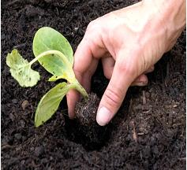
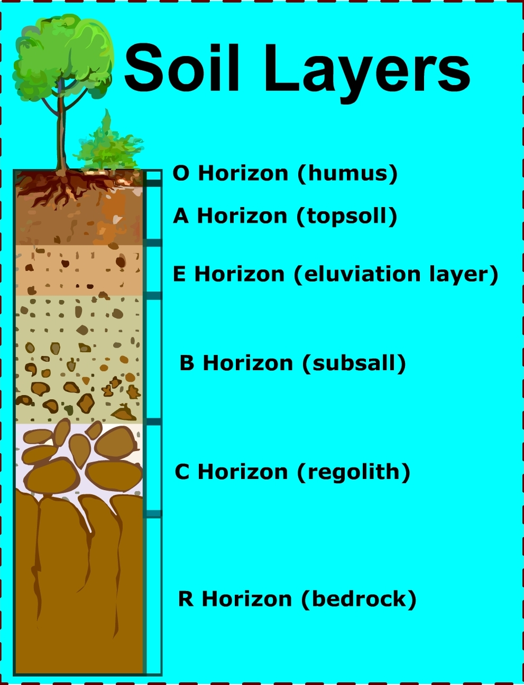

### Theory 

<h2>Introduction:</h2>

A soil analysis is a process by which elements such as P, K, Ca, Mg, Na, S, Mn, Cu and Zn are chemically extracted from the soil and measured for their “plant available” content within the soil sample.

  

 

<h2>Significance of Soil Analysis:</h2>
<ul>
  <li>It increases the knowledge of what nutrients are especially available in our soil.</li>
  <li>It reduces the environmental impacts due to soil amendments.</li>
  <li>It increases the efficiency of resource inputs such as fertilisers and water.</li>
  <li>It helps to predict the nutritional values needed for crop production.</li>
  <li>It helps to evaluate the fertility status of soils of a country, state, or a district.</li>
</ul>

<h2>Procedure for Taking Good Soil Samples:</h2>
<ol>
  <li>Determine the soil unit (or plot).</li>
  <li>Make a traverse over the soil unit (or plot).</li>
  <li>Clean the site (with spade) from where soil sample is to be collected.</li>
  <li>Insert the spade into soil.</li>
  <li>Standing on the opposite side, again insert the spade into soil.</li>
  <li>A lump of soil is removed.</li>
  <li>A pit of ‘V’ shape is formed. Its depth should be 0-6" or 0-9" or 0-12" (i.e., Depth of tillage).</li>
  <li>Take out the soil-slice (like a bread slice) of ½ inch thick from both the exposed surface of the pit from top to bottom. This slice is also termed furrow-slice. To collect the soil-slice, a spade may be used. Collect the soil samples in a polyethylene bucket.</li>
  <li>Collect furrow-slices from 8-10 or up to 20-30 sites. Select the sites at random in a zigzag (or criss-cross) manner. Distribute the sites throughout the entire soil unit (plot). In lieu of spade, an auger may be used. Do not take the prohibited samples and local problem soils.</li>
  <li>Furnish the following information in two sheets of thick paper with the sample. One sheet is folded and kept inside the bag. Another sheet is folded and attached to the bag.</li>
</ol>

  

 

<h2>Soil Organic Matter:</h2>

Soil organic matter represents the remains of roots, plant material, and soil organisms in various stages of decomposition and synthesis, and is variable in composition. Though occurring in small amounts in soil, organic matter has a major influence on soil aggregation, nutrient reserve and its availability, moisture retention, and biological activity.

<h3>Principle:</h3>

In the detection of soil Organic Carbon, a known weight of soil is heated with an excess volume of standard K2Cr2O7 in the presence of concentrated H2SO4. The soil is slowly digested at low temperature by the heat of dilution of H2SO4, and the organic carbon in the soil is thus oxidized to CO2.

The highest temperature attained by the heat of dilution reaction with H2SO4 is approximately 120&deg;C, which is sufficient to oxidize the active forms of the soil organic carbon but not the more inert forms. The excess K2Cr2O7 not reduced by organic matter is titrated against a standard solution of Ferrous Ammonium Sulphate in the presence of phosphoric acid and diphenylamine as indicator.

While measuring oxidisable Organic Carbon, the data are often converted to percentage organic matter using a constant factor, assuming organic matter contains 58% Organic Carbon. However, since this proportion varies, it is preferable to report oxidisable Organic Carbon directly, or multiply it by 1.334 to express as Organic Carbon.

<h3>Significance:</h3>

The term ‘Organic Matter in Soil’ embraces the whole known mineral fraction of soil and consists essentially of a series of products, which range from decayed plant and animal tissues to fairly amorphous brown to black material normally defined as ‘soil humus’.

Organic matter also contains living and dead microbial tissues, microbially synthesized compound and derivatives of these materials produced as a result of microbial decay.

 

<h2>Role of Soil Organic Matter</h2>

The role of soil organic matter, in relation to soil fertility and physical conditions. Sources of plant nutrients which are released in assimilated forms during microbial degradation. Soil organic matter contains 5 % Nitrogen, 0.5 % each of Phosphorus and Sulfur. Thereby having the ratio of 10:1. The organic matter of a soil is estimated by the amount of Carbon present, as this element represents on an average, 52-58 % of the organic matter and the C: N ratio is 10-15.

